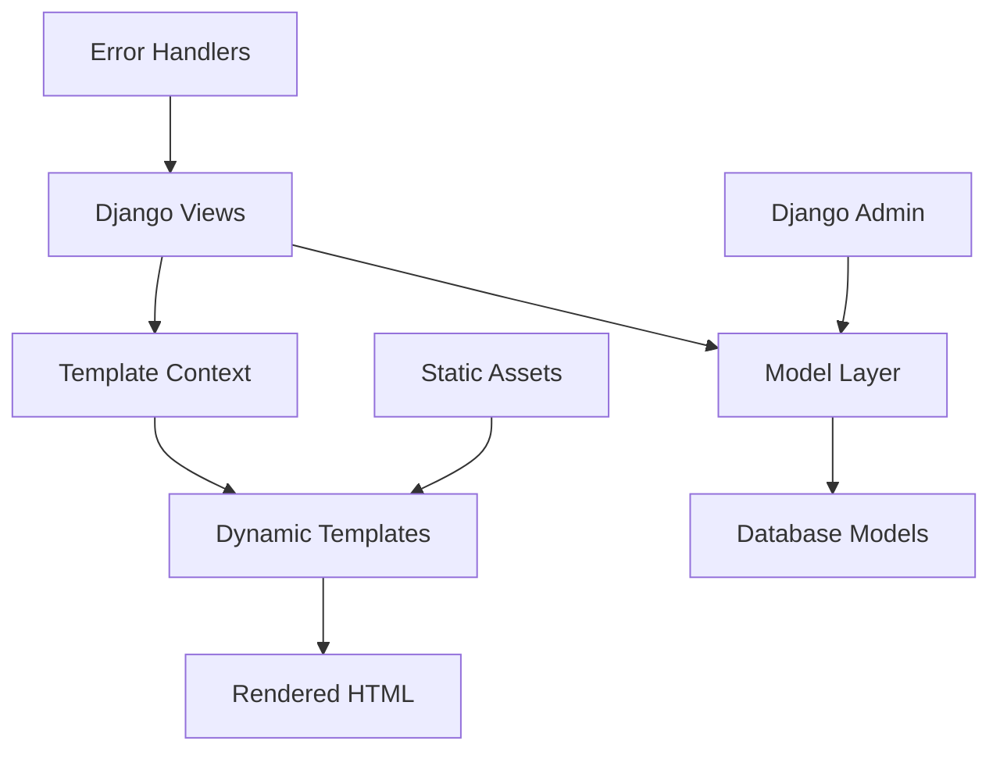
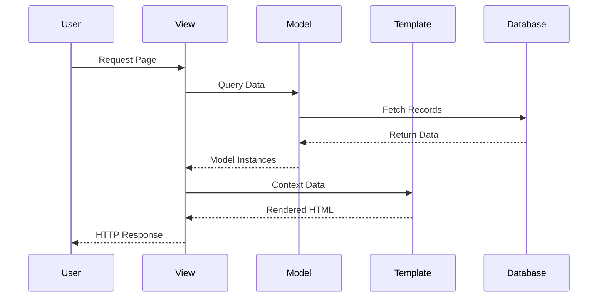
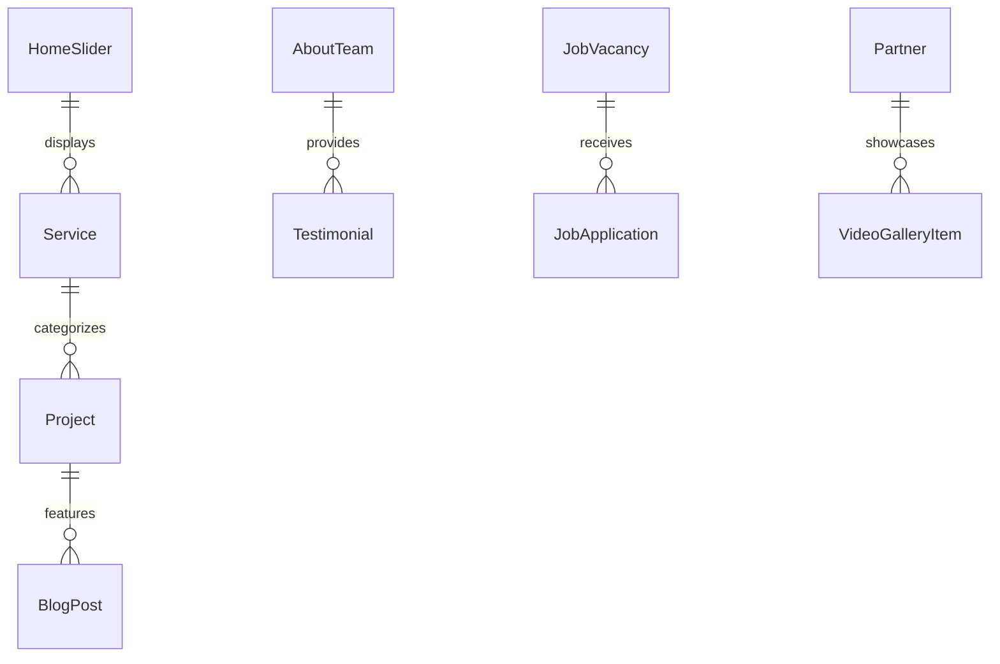

# Design Document

## Overview

The Dynamic Content Integration feature transforms the existing Django web application from static template content to a fully dynamic, database-driven system. The application currently has comprehensive models but uses basic TemplateView classes that don't pass model data to templates. This design integrates the existing rich models (HomeSlider, Service, AboutTeam, Testimonial, Project, BlogPost, JobVacancy, Partner, CompanyStatistic, etc.) with the template system while preserving the existing design and functionality.

The solution follows Django best practices by updating views to use context data, implementing template filters for data formatting, and adding robust error handling for missing or incomplete data.

## Architecture

### High-Level Architecture



### Component Interaction Flow



## Components and Interfaces

### 1. Enhanced View Classes

**Base Dynamic View**
```python
class BaseDynamicView(TemplateView):
    """Base class for all dynamic content views"""
    
    def get_context_data(self, **kwargs):
        context = super().get_context_data(**kwargs)
        context.update(self.get_dynamic_context())
        return context
    
    def get_dynamic_context(self):
        """Override in subclasses to provide specific context"""
        return {}
    
    def handle_missing_data(self, model_class, fallback_data=None):
        """Handle cases where model data is missing"""
        pass
```

**Enhanced View Classes**
- `IndexView`: Homepage with sliders, services, statistics, testimonials
- `AboutView`: Team members and company information
- `ServicesView`: Service listings with categories and tags
- `ProjectView`: Project portfolio with filtering
- `BlogView`: Blog posts with pagination
- `JobListView`: Job vacancies with filtering
- `TeamView`: Team member profiles

### 2. Template Context Processors

**Global Context Processor**
```python
def global_context(request):
    """Provides site-wide context data"""
    return {
        'site_statistics': CompanyStatistic.objects.all().order_by('order'),
        'active_partners': Partner.objects.all(),
        'navigation_services': Service.objects.all()[:5],
    }
```

### 3. Template Filters and Tags

**Custom Template Filters**
- `truncate_words_html`: Safe HTML truncation
- `format_tags`: Convert comma-separated tags to list
- `default_image`: Provide fallback images
- `format_currency`: Format salary ranges
- `social_icon`: Generate social media icons

### 4. Error Handling Components

**Graceful Degradation System**
- Missing image handlers
- Empty content fallbacks
- Database connection error handling
- Template rendering error recovery

## Data Models

### Existing Models Integration

The design leverages existing models without modification:

**Content Models**
- `HomeSlider`: Homepage hero content
- `Service`: Service offerings with icons and descriptions
- `AboutTeam`: Team member profiles
- `Testimonial`: Client testimonials with ratings
- `Project`: Portfolio projects with categories
- `BlogPost`: News and blog content
- `JobVacancy`: Job listings with detailed requirements

**Supporting Models**
- `Partner`: Company partners and logos
- `CompanyStatistic`: Homepage statistics
- `VideoGalleryItem`: Video content
- `ChatBotConfig`: AI assistant configuration

### Data Relationships



## Correctness Properties

*A property is a characteristic or behavior that should hold true across all valid executions of a system-essentially, a formal statement about what the system should do. Properties serve as the bridge between human-readable specifications and machine-verifiable correctness guarantees.*

Based on the prework analysis, the following properties ensure system correctness:

**Property 1: Homepage Dynamic Content Display**
*For any* homepage request, when active HomeSlider entries exist in the database, the system should display only those active entries instead of static content
**Validates: Requirements 1.1**

**Property 2: Admin Changes Immediate Reflection**
*For any* content updated through Django admin interface, the changes should be immediately visible on the corresponding public pages without requiring server restarts or code deployment
**Validates: Requirements 1.2, 2.5, 5.5**

**Property 3: Service Data Rendering**
*For any* Service model entries, the homepage should retrieve and display them with proper formatting including icons, descriptions, and tags
**Validates: Requirements 1.3, 3.3**

**Property 4: Statistics Ordering Consistency**
*For any* CompanyStatistic entries, they should be displayed on the homepage in the order specified by their order field
**Validates: Requirements 1.4**

**Property 5: Graceful Empty Content Handling**
*For any* page section with no corresponding model data, the system should display appropriate fallback content or hide the section without breaking the layout
**Validates: Requirements 1.5, 4.5, 6.2**

**Property 6: Team Member Complete Display**
*For any* AboutTeam entries, the team page should display all active members with complete profile information including bio, social media links, and images
**Validates: Requirements 2.1, 2.2, 2.4**

**Property 7: Missing Media Graceful Handling**
*For any* model entry with missing or corrupted media files (images, videos, documents), the system should display appropriate placeholder content without breaking the layout
**Validates: Requirements 2.3, 3.5, 7.3**

**Property 8: Project Filtering Accuracy**
*For any* project page request with category or featured status filters, the system should display only Project entries that match the specified criteria
**Validates: Requirements 3.1, 4.2**

**Property 9: Complete Field Display**
*For any* model entry (Project, JobVacancy, BlogPost), all populated fields should be included in the rendered template output
**Validates: Requirements 3.2, 4.3, 5.2**

**Property 10: Tag Formatting Consistency**
*For any* Service or Project with tags, they should be displayed as properly formatted, clickable elements
**Validates: Requirements 3.4**

**Property 11: Job Application Data Integrity**
*For any* job application form submission, the data should be correctly stored in the JobApplication model with all required fields validated
**Validates: Requirements 4.4**

**Property 12: Content Ordering Consistency**
*For any* BlogPost entries, they should be displayed on the blog page ordered by publication date in descending order
**Validates: Requirements 5.1**

**Property 13: Testimonial Complete Display**
*For any* Testimonial entries, they should be displayed with client information, ratings, and functional download links for any attachments
**Validates: Requirements 5.3, 5.4**

**Property 14: Template Structure Preservation**
*For any* template updated for dynamic content, all existing CSS classes, HTML structure, and responsive design functionality should remain intact
**Validates: Requirements 6.1, 6.3, 6.4, 6.5**

**Property 15: HTML Validity Maintenance**
*For any* template with dynamic loops, the generated HTML should pass validation and maintain accessibility standards
**Validates: Requirements 6.4**

**Property 16: Database Error Recovery**
*For any* database query failure, the system should log the error and display fallback content to users without exposing technical details
**Validates: Requirements 7.1, 7.5**

**Property 17: Template Error Resilience**
*For any* template rendering with missing variables or data, the system should handle exceptions gracefully without breaking the page
**Validates: Requirements 7.2**

**Property 18: Admin Data Validation**
*For any* content changes made through Django admin, the system should validate data integrity before saving and prevent invalid data from causing rendering failures
**Validates: Requirements 7.4**

**Property 19: Multi-format Media Support**
*For any* media upload through admin (images, videos), the system should handle multiple formats correctly and provide appropriate compression or processing
**Validates: Requirements 8.1, 8.2**

**Property 20: Rich Text Preservation**
*For any* content with rich text formatting and special characters, the system should preserve formatting and handle characters correctly in template rendering
**Validates: Requirements 8.3**

**Property 21: Content Organization Functionality**
*For any* content with categories or tags, the system should provide intuitive filtering and organization capabilities
**Validates: Requirements 8.4**

**Property 22: Secure File Access**
*For any* file attachments in content, the system should provide secure download functionality with proper access controls
**Validates: Requirements 8.5**

## Error Handling

### Error Categories and Responses

**Database Errors**
- Connection failures: Display cached content or static fallbacks
- Query timeouts: Log error, return partial content
- Data corruption: Validate and sanitize before display

**Template Errors**
- Missing template variables: Use default values
- Image loading failures: Show placeholder images
- Loop rendering errors: Skip problematic items, continue rendering

**Media File Errors**
- Missing images: Display default placeholder
- Corrupted videos: Hide video player, show static image
- Inaccessible documents: Display error message with contact info

### Error Recovery Strategies

```python
def safe_model_query(model_class, **filters):
    """Safely query models with error handling"""
    try:
        return model_class.objects.filter(**filters)
    except DatabaseError as e:
        logger.error(f"Database error in {model_class.__name__}: {e}")
        return model_class.objects.none()
    except Exception as e:
        logger.error(f"Unexpected error in {model_class.__name__}: {e}")
        return model_class.objects.none()
```

## Testing Strategy

### Dual Testing Approach

The testing strategy combines unit testing and property-based testing to ensure comprehensive coverage:

**Unit Testing**
- Test specific view context data generation
- Verify template rendering with known data sets
- Test error handling with missing data scenarios
- Validate admin integration functionality

**Property-Based Testing**
- Use Django's TestCase with Hypothesis for property-based testing
- Generate random model data to test template rendering
- Verify graceful degradation across various data states
- Test performance characteristics with varying data volumes

**Property-Based Testing Configuration**
- Library: Hypothesis for Python/Django
- Minimum iterations: 100 per property test
- Each property test tagged with format: **Feature: dynamic-content-integration, Property {number}: {property_text}**
- Each correctness property implemented by a single property-based test

**Integration Testing**
- End-to-end template rendering tests
- Admin interface integration tests
- Media file handling tests
- Cross-browser compatibility tests

**Performance Testing**
- Database query optimization validation
- Template rendering performance benchmarks
- Memory usage monitoring with large datasets
- Caching effectiveness measurement